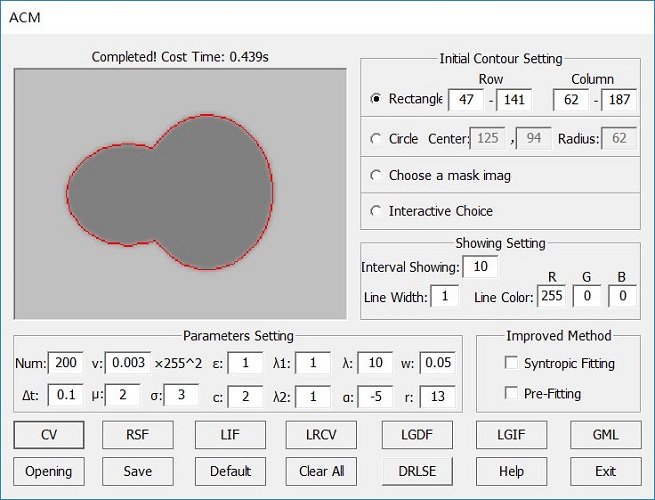

# A-GUI-with-Opencv3-and-Qt5-for-Active-Contour-Model
It includes many well-known models: CV, RSF, LIF, LRCV, LGDF, LGIF, DRLSE, GML, and proposed methods: Syntropic fitting, Pre-fitting.
The implementation efficiency of this GUI is much faster than the code written by Matlab.  

---
 
